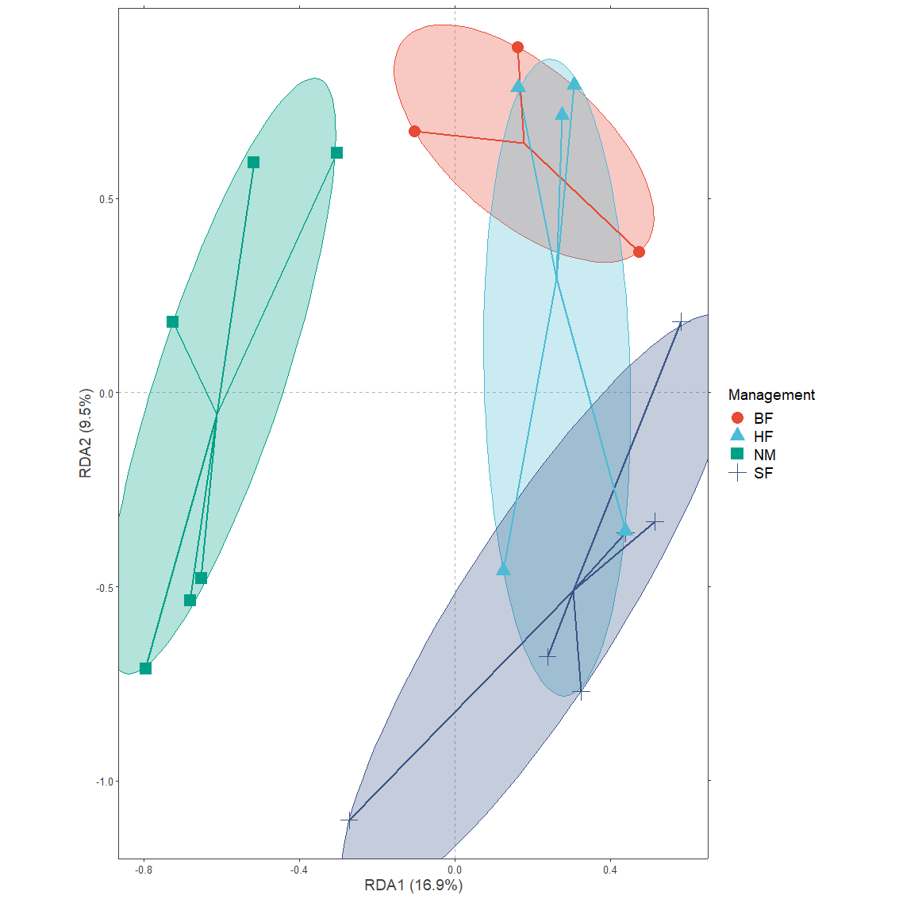
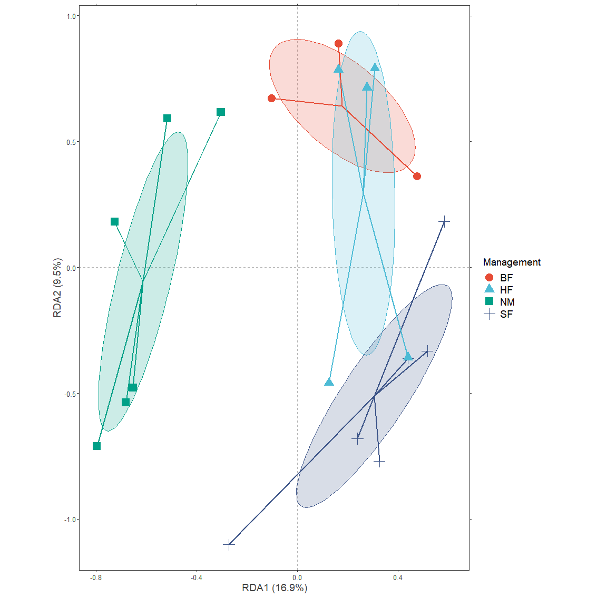
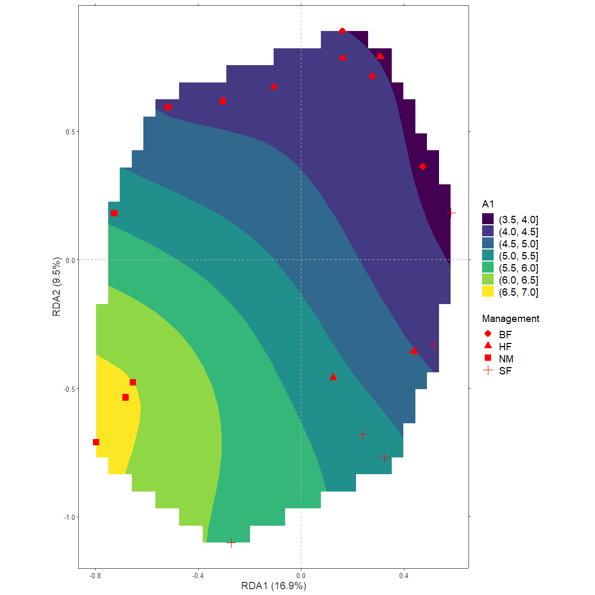
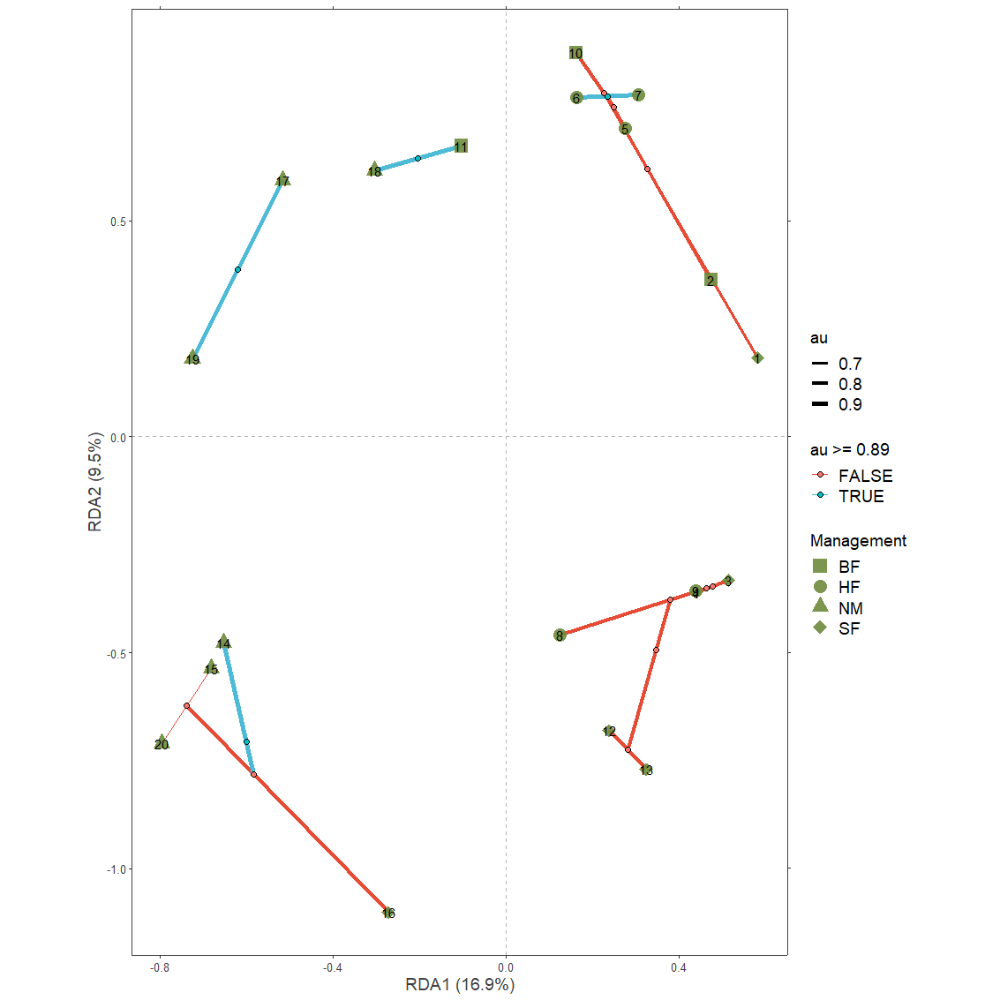

<!-- README.md is generated from README.Rmd. Please edit that file -->

# BiodiversityR

`BiodiversityR` is an R package for statistical analysis of biodiversity
and ecological communities, including species accumulation curves,
diversity indices, Renyi profiles, GLMs for analysis of species
abundance and presence-absence, distance matrices, Mantel tests, and
cluster, constrained and unconstrained ordination analysis.

The package was initially built to provide a graphical user interface
and different helper functions for the `vegan` community ecology
package. As documented in a manual on biodiversity and community ecology
analysis, available from [this
website](http://www.worldagroforestry.org/output/tree-diversity-analysis)
and [this
link](http://www.worldagroforestry.org/downloads/Publications/PDFS/B13695.pdf),
most analysis pipelines require a **community matrix** (typically having
sites as rows, species as columns and abundance values as cell values)
and an **environmental data set** (typically providing numerical and
categorical variables for the different sites) as inputs. After being
launched on CRAN, new methods from `vegan` have been integrated in the
package as documented in the
[**ChangeLog**](https://cran.r-project.org/package=BiodiversityR/ChangeLog)
file.

A major update of `BiodiversityR` involved the inclusion of different
methods of ensemble suitability modelling, as described
[here](https://doi.org/10.1016/j.envsoft.2017.11.009). Most of the
functions for ensemble suitability modelling were named with a
ensemble.XXXX() naming template.

At the end of 2021, some methods to facilitate plotting results via
`ggplot` were included in `BiodiversityR`. These methods are described
in detail in [this rpubs series](https://rpubs.com/Roeland-KINDT), with
some examples given below.

# Packages needed

``` r
library(BiodiversityR) # also loads vegan

library(ggplot2)
library(ggforce)
library(concaveman)
library(ggrepel)
library(ggsci)
library(dplyr)
library(pvclust)
```

# Data

The data in the examples are data that were used as case study in [Data
Analysis in Community and Landscape
Ecology](https://doi.org/10.1017/CBO9780511525575) and also in the Tree
Diversity Analysis manual.

Data set **dune** is a community data set, where variables (columns)
typically correspond to different species and data represents abundance
of each species. Species names were abbreviated to eight characters,
with for example Agrostol representing [*Agrostis
stolonifera*](https://apps.worldagroforestry.org/products/switchboard/index.php/name_like/Agrostis%20stolonifera).

``` r
data(dune)
str(dune)
#> 'data.frame':    20 obs. of  30 variables:
#>  $ Achimill: num  1 3 0 0 2 2 2 0 0 4 ...
#>  $ Agrostol: num  0 0 4 8 0 0 0 4 3 0 ...
#>  $ Airaprae: num  0 0 0 0 0 0 0 0 0 0 ...
#>  $ Alopgeni: num  0 2 7 2 0 0 0 5 3 0 ...
#>  $ Anthodor: num  0 0 0 0 4 3 2 0 0 4 ...
#>  $ Bellpere: num  0 3 2 2 2 0 0 0 0 2 ...
#>  $ Bromhord: num  0 4 0 3 2 0 2 0 0 4 ...
#>  $ Chenalbu: num  0 0 0 0 0 0 0 0 0 0 ...
#>  $ Cirsarve: num  0 0 0 2 0 0 0 0 0 0 ...
#>  $ Comapalu: num  0 0 0 0 0 0 0 0 0 0 ...
#>  $ Eleopalu: num  0 0 0 0 0 0 0 4 0 0 ...
#>  $ Elymrepe: num  4 4 4 4 4 0 0 0 6 0 ...
#>  $ Empenigr: num  0 0 0 0 0 0 0 0 0 0 ...
#>  $ Hyporadi: num  0 0 0 0 0 0 0 0 0 0 ...
#>  $ Juncarti: num  0 0 0 0 0 0 0 4 4 0 ...
#>  $ Juncbufo: num  0 0 0 0 0 0 2 0 4 0 ...
#>  $ Lolipere: num  7 5 6 5 2 6 6 4 2 6 ...
#>  $ Planlanc: num  0 0 0 0 5 5 5 0 0 3 ...
#>  $ Poaprat : num  4 4 5 4 2 3 4 4 4 4 ...
#>  $ Poatriv : num  2 7 6 5 6 4 5 4 5 4 ...
#>  $ Ranuflam: num  0 0 0 0 0 0 0 2 0 0 ...
#>  $ Rumeacet: num  0 0 0 0 5 6 3 0 2 0 ...
#>  $ Sagiproc: num  0 0 0 5 0 0 0 2 2 0 ...
#>  $ Salirepe: num  0 0 0 0 0 0 0 0 0 0 ...
#>  $ Scorautu: num  0 5 2 2 3 3 3 3 2 3 ...
#>  $ Trifprat: num  0 0 0 0 2 5 2 0 0 0 ...
#>  $ Trifrepe: num  0 5 2 1 2 5 2 2 3 6 ...
#>  $ Vicilath: num  0 0 0 0 0 0 0 0 0 1 ...
#>  $ Bracruta: num  0 0 2 2 2 6 2 2 2 2 ...
#>  $ Callcusp: num  0 0 0 0 0 0 0 0 0 0 ...
```

Data set **dune.env** is an environmental data set, where variables
(columns) correspond to different descriptors (typically continuous and
categorical variables) of the sample sites. One of the variables is
**Management**, a categorical variable that describes different
management categories, coded as BF (an abbreviation for biological
farming), HF (hobby farming), NM (nature conservation management) and SF
(standard farming).

``` r
data(dune.env)
summary(dune.env)
#>        A1         Moisture Management       Use    Manure
#>  Min.   : 2.800   1:7      BF:3       Hayfield:7   0:6   
#>  1st Qu.: 3.500   2:4      HF:5       Haypastu:8   1:3   
#>  Median : 4.200   4:2      NM:6       Pasture :5   2:4   
#>  Mean   : 4.850   5:7      SF:6                    3:4   
#>  3rd Qu.: 5.725                                    4:3   
#>  Max.   :11.500
```

For some plotting methods, it is necessary that the environmental data
set is attached:

``` r
attach(dune.env)
```

# Ordination model

For the examples, we use the constrained ordination method of
**redundancy analysis**.

The ordiplot object is obtained from the result of via function **rda**.
The ordination is done with a community data set that is transformed by
the Hellinger method as recommended in [this
article](http://dx.doi.org/10.1007%2Fs004420100716).

``` r
# script generated by the BiodiversityR GUI from the constrained ordination menu
dune.Hellinger <- disttransform(dune, method='hellinger')
Ordination.model1 <- rda(dune.Hellinger ~ Management, 
                         data=dune.env, 
                         scaling="species")
summary(Ordination.model1)
#> 
#> Call:
#> rda(formula = dune.Hellinger ~ Management, data = dune.env, scaling = "species") 
#> 
#> Partitioning of variance:
#>               Inertia Proportion
#> Total          0.5559     1.0000
#> Constrained    0.1667     0.2999
#> Unconstrained  0.3892     0.7001
#> 
#> Eigenvalues, and their contribution to the variance 
#> 
#> Importance of components:
#>                          RDA1    RDA2    RDA3    PC1     PC2     PC3     PC4
#> Eigenvalue            0.09377 0.05304 0.01988 0.1279 0.05597 0.04351 0.03963
#> Proportion Explained  0.16869 0.09542 0.03575 0.2300 0.10069 0.07827 0.07129
#> Cumulative Proportion 0.16869 0.26411 0.29986 0.5299 0.63054 0.70881 0.78010
#>                           PC5     PC6     PC7     PC8     PC9     PC10     PC11
#> Eigenvalue            0.03080 0.02120 0.01623 0.01374 0.01138 0.009469 0.007651
#> Proportion Explained  0.05541 0.03814 0.02919 0.02471 0.02047 0.017034 0.013764
#> Cumulative Proportion 0.83551 0.87365 0.90284 0.92755 0.94802 0.965056 0.978820
#>                           PC12     PC13     PC14     PC15      PC16
#> Eigenvalue            0.003957 0.003005 0.002485 0.001670 0.0006571
#> Proportion Explained  0.007117 0.005406 0.004470 0.003004 0.0011821
#> Cumulative Proportion 0.985937 0.991344 0.995814 0.998818 1.0000000
#> 
#> Accumulated constrained eigenvalues
#> Importance of components:
#>                          RDA1    RDA2    RDA3
#> Eigenvalue            0.09377 0.05304 0.01988
#> Proportion Explained  0.56255 0.31822 0.11923
#> Cumulative Proportion 0.56255 0.88077 1.00000
#> 
#> Scaling 2 for species and site scores
#> * Species are scaled proportional to eigenvalues
#> * Sites are unscaled: weighted dispersion equal on all dimensions
#> * General scaling constant of scores:  1.80276 
#> 
#> 
#> Species scores
#> 
#>               RDA1      RDA2      RDA3       PC1       PC2       PC3
#> Achimill  0.036568  0.127978  0.016399 -0.188968 -0.070111  0.175399
#> Agrostol -0.003429 -0.270611 -0.018285  0.361207  0.005321 -0.014204
#> Airaprae -0.127487 -0.011618 -0.005281 -0.120126  0.103133  0.060671
#> Alopgeni  0.235229 -0.190348  0.027102  0.163865  0.129547 -0.078901
#> Anthodor -0.085534  0.115742 -0.079991 -0.240230  0.117203  0.201272
#> Bellpere  0.033345  0.041954  0.083723 -0.081623 -0.079661 -0.076104
#> Bromhord  0.093316  0.120369  0.065335 -0.058227 -0.047198  0.043097
#> Chenalbu  0.016343 -0.027339  0.008563  0.006896  0.028380  0.004920
#> Cirsarve  0.019792 -0.033109  0.010370 -0.009773 -0.008401 -0.025099
#> Comapalu -0.110016 -0.010026 -0.004558  0.091463 -0.045993  0.026311
#> Eleopalu -0.160847 -0.069849 -0.041472  0.352544 -0.115164  0.126956
#> Elymrepe  0.173955 -0.047695 -0.002020 -0.108520 -0.206622 -0.115376
#> Empenigr -0.047886 -0.004364 -0.001984 -0.029817  0.061163 -0.018612
#> Hyporadi -0.130851  0.036162  0.047182 -0.127285  0.148136  0.027482
#> Juncarti -0.057086 -0.003074 -0.101556  0.265930 -0.061713 -0.009618
#> Juncbufo  0.102986 -0.052188 -0.062882  0.033316  0.152206 -0.038314
#> Lolipere  0.260211  0.153503  0.052002 -0.192751 -0.234269 -0.146056
#> Planlanc -0.018339  0.192788 -0.064491 -0.222661  0.025888  0.091459
#> Poaprat   0.183546  0.093202  0.019068 -0.196708 -0.136129 -0.115068
#> Poatriv   0.377233 -0.046485 -0.039312 -0.019700 -0.010085  0.010877
#> Ranuflam -0.113470 -0.073249 -0.022781  0.249877 -0.046445  0.073742
#> Rumeacet  0.118187  0.070051 -0.198589 -0.056786  0.065922  0.042193
#> Sagiproc  0.076848 -0.060054  0.017557  0.035039  0.222856 -0.152162
#> Salirepe -0.197203 -0.017971 -0.008170 -0.014209  0.015031 -0.104243
#> Scorautu -0.146131  0.134240  0.015763 -0.059562  0.117768 -0.088453
#> Trifprat  0.061485  0.069094 -0.135080 -0.066713 -0.001921  0.069306
#> Trifrepe  0.010076  0.151446  0.031054  0.039480  0.082043 -0.081712
#> Vicilath -0.014220  0.076123  0.084100 -0.026628  0.009338 -0.057100
#> Bracruta -0.057834  0.021502 -0.054847  0.083143  0.070717 -0.115855
#> Callcusp -0.107307 -0.059711  0.009214  0.169330 -0.068364  0.107835
#> 
#> 
#> Site scores (weighted sums of species scores)
#> 
#>       RDA1    RDA2     RDA3      PC1      PC2       PC3
#> 1   0.5831  0.1826  0.52222 -0.59008 -0.95148 -0.002365
#> 2   0.4752  0.3624  0.90879  0.05773 -0.27927 -0.053465
#> 3   0.5157 -0.3323  0.54177 -0.17847 -0.28527 -0.368932
#> 4   0.4399 -0.3608  0.65164 -0.15066 -0.12951 -0.386916
#> 5   0.2767  0.7135 -0.68027 -0.32785 -0.13648  0.331094
#> 6   0.1630  0.7846 -0.99354 -0.24794  0.06413  0.280023
#> 7   0.3075  0.7908 -0.69144 -0.29554  0.01116  0.283797
#> 8   0.1248 -0.4586 -0.03533  0.58291 -0.02785 -0.296149
#> 9   0.4391 -0.3568 -0.47994  0.28843  0.08904 -0.598766
#> 10  0.1626  0.8889  0.52513 -0.10281 -0.02239  0.398688
#> 11 -0.1034  0.6728  0.63968  0.04508  0.30166 -0.345223
#> 12  0.2387 -0.6802 -0.39191  0.13764  0.90201 -0.091365
#> 13  0.3253 -0.7706  0.08451  0.12875  0.52983  0.091846
#> 14 -0.6531 -0.4778  0.18077  0.45837 -0.26343  0.275022
#> 15 -0.6814 -0.5359 -0.46471  0.55931 -0.24900  0.020745
#> 16 -0.2720 -1.1011 -0.44903  0.65282 -0.06558  0.757733
#> 17 -0.5168  0.5924 -0.02957 -0.74414  0.25120  0.742874
#> 18 -0.3035  0.6161  0.46554 -0.42677 -0.21642 -0.831729
#> 19 -0.7255  0.1808  0.15665 -0.38151  0.78259 -0.238142
#> 20 -0.7960 -0.7107 -0.46098  0.53475 -0.30493  0.031229
#> 
#> 
#> Site constraints (linear combinations of constraining variables)
#> 
#>       RDA1     RDA2     RDA3      PC1      PC2       PC3
#> 1   0.3051 -0.51040  0.15987 -0.59008 -0.95148 -0.002365
#> 2   0.1781  0.64135  0.69120  0.05773 -0.27927 -0.053465
#> 3   0.3051 -0.51040  0.15987 -0.17847 -0.28527 -0.368932
#> 4   0.3051 -0.51040  0.15987 -0.15066 -0.12951 -0.386916
#> 5   0.2622  0.29468 -0.57610 -0.32785 -0.13648  0.331094
#> 6   0.2622  0.29468 -0.57610 -0.24794  0.06413  0.280023
#> 7   0.2622  0.29468 -0.57610 -0.29554  0.01116  0.283797
#> 8   0.2622  0.29468 -0.57610  0.58291 -0.02785 -0.296149
#> 9   0.2622  0.29468 -0.57610  0.28843  0.08904 -0.598766
#> 10  0.1781  0.64135  0.69120 -0.10281 -0.02239  0.398688
#> 11  0.1781  0.64135  0.69120  0.04508  0.30166 -0.345223
#> 12  0.3051 -0.51040  0.15987  0.13764  0.90201 -0.091365
#> 13  0.3051 -0.51040  0.15987  0.12875  0.52983  0.091846
#> 14 -0.6127 -0.05584 -0.02538  0.45837 -0.26343  0.275022
#> 15 -0.6127 -0.05584 -0.02538  0.55931 -0.24900  0.020745
#> 16  0.3051 -0.51040  0.15987  0.65282 -0.06558  0.757733
#> 17 -0.6127 -0.05584 -0.02538 -0.74414  0.25120  0.742874
#> 18 -0.6127 -0.05584 -0.02538 -0.42677 -0.21642 -0.831729
#> 19 -0.6127 -0.05584 -0.02538 -0.38151  0.78259 -0.238142
#> 20 -0.6127 -0.05584 -0.02538  0.53475 -0.30493  0.031229
#> 
#> 
#> Biplot scores for constraining variables
#> 
#>                 RDA1     RDA2     RDA3 PC1 PC2 PC3
#> ManagementHF  0.3756  0.42205 -0.82512   0   0   0
#> ManagementNM -0.9950 -0.09068 -0.04122   0   0   0
#> ManagementSF  0.4955 -0.82890  0.25963   0   0   0
#> 
#> 
#> Centroids for factor constraints
#> 
#>                 RDA1     RDA2     RDA3 PC1 PC2 PC3
#> ManagementBF  0.1781  0.64135  0.69120   0   0   0
#> ManagementHF  0.2622  0.29468 -0.57610   0   0   0
#> ManagementNM -0.6127 -0.05584 -0.02538   0   0   0
#> ManagementSF  0.3051 -0.51040  0.15987   0   0   0
```

# Prepare to modify the ggplot theme

For the different graphs, the **theme** for ggplot2 plotting will be
modified as follows, resulting in a more empty plotting canvas than the
default for ggplot2.

``` r
BioR.theme <- theme(
        panel.background = element_blank(),
        panel.border = element_blank(),
        panel.grid = element_blank(),
        axis.line = element_line("gray25"),
        text = element_text(size = 12),
        axis.text = element_text(size = 10, colour = "gray25"),
        axis.title = element_text(size = 14, colour = "gray25"),
        legend.title = element_text(size = 14),
        legend.text = element_text(size = 14),
        legend.key = element_blank())
```

# Example 1: ordispider diagrams for categorical variables

## Extract the data

The ordination result needs to be plotted first via **ordiplot**.

``` r
plot1 <- ordiplot(Ordination.model1, choices=c(1,2))
```

<!-- -->

To plot data via ggplot2, information on the locations of sites (circles
in the ordiplot) is obtained via function **sites.long**. Information on
species is extracted by function **species.long**.

``` r
sites.long1 <- sites.long(plot1, env.data=dune.env)
head(sites.long1)
#>    A1 Moisture Management      Use Manure     axis1      axis2 labels
#> 1 2.8        1         SF Haypastu      4 0.5831201  0.1825554      1
#> 2 3.5        1         BF Haypastu      2 0.4751761  0.3624230      2
#> 3 4.3        2         SF Haypastu      4 0.5157071 -0.3323011      3
#> 4 4.2        2         SF Haypastu      4 0.4398671 -0.3607994      4
#> 5 6.3        1         HF Hayfield      2 0.2767400  0.7134658      5
#> 6 4.3        1         HF Haypastu      2 0.1630074  0.7845782      6
```

Information on the labelling of the axes is obtained with function
**axis.long**. This information is extracted from the ordination model
and not the ordiplot, hence it is important to select the same axes via
argument ‘choices’. The extracted information includes information on
the percentage of explained variation. I suggest that you cross-check
with the summary of the redundancy analysis, where information on
proportion explained is given.

``` r
axis.long1 <- axis.long(Ordination.model1, choices=c(1, 2))
axis.long1
#>   axis     ggplot        label
#> 1    1 xlab.label RDA1 (16.9%)
#> 2    2 ylab.label  RDA2 (9.5%)
```

## Generate the plot

Function **centroids.long** obtains data on the centroids of each
grouping. It is possible to directly add their results as ‘ordispider
diagrams’ in ggplot. Here also another layer is added of
**superellipses** obtained from the ggforce::geom\_mark\_ellipse
function.

``` r
plotgg1 <- ggplot() + 
    geom_vline(xintercept = c(0), color = "grey70", linetype = 2) +
    geom_hline(yintercept = c(0), color = "grey70", linetype = 2) +  
    xlab(axis.long1[1, "label"]) +
    ylab(axis.long1[2, "label"]) +  
    scale_x_continuous(sec.axis = dup_axis(labels=NULL, name=NULL)) +
    scale_y_continuous(sec.axis = dup_axis(labels=NULL, name=NULL)) +
    geom_mark_ellipse(data=sites.long1, 
                      aes(x=axis1, y=axis2, colour=Management, 
                          fill=after_scale(alpha(colour, 0.2))), 
                      expand=0, size=0.2, show.legend=FALSE) +
    geom_segment(data=centroids.long(sites.long1, grouping=Management), 
                 aes(x=axis1c, y=axis2c, xend=axis1, yend=axis2, colour=Management), 
                 size=1, show.legend=FALSE) +
    geom_point(data=sites.long1, 
               aes(x=axis1, y=axis2, colour=Management, shape=Management), 
               size=5) +
    BioR.theme +
    ggsci::scale_colour_npg() +
    coord_fixed(ratio=1)

plotgg1
```

<!-- -->

# Example 2: Confidence ellipses for categorical variables

## Extract the data

Function **ordiellipse.long** reproduces similar ellipses as
**vegan::ordiellipse**.

It is necessary to re-plot the ordiplot. It is also necessary to give
the name of the Management variable explicitly as this was not captured
in the ordiellipse result.

``` r
plot1 <- ordiplot(Ordination.model1, choices=c(1,2))
Management.ellipses <- ordiellipse(plot1, 
                                   groups=Management, 
                                   display="sites", 
                                   kind="sd")
```

<!-- -->

``` r
Management.ellipses.long1 <- ordiellipse.long(Management.ellipses,
                                              grouping.name="Management")
```

## Generate the plot

``` r
plotgg2 <- ggplot() + 
    geom_vline(xintercept = c(0), color = "grey70", linetype = 2) +
    geom_hline(yintercept = c(0), color = "grey70", linetype = 2) +  
    xlab(axis.long1[1, "label"]) +
    ylab(axis.long1[2, "label"]) +  
    scale_x_continuous(sec.axis = dup_axis(labels=NULL, name=NULL)) +
    scale_y_continuous(sec.axis = dup_axis(labels=NULL, name=NULL)) +
    geom_polygon(data=Management.ellipses.long1, 
                   aes(x=axis1, y=axis2, 
                       colour=Management, 
                       fill=after_scale(alpha(colour, 0.2))), 
              size=0.2, show.legend=FALSE) +
    geom_segment(data=centroids.long(sites.long1, 
                                     grouping=Management), 
                 aes(x=axis1c, y=axis2c, xend=axis1, yend=axis2, 
                     colour=Management), 
                 size=1, show.legend=FALSE) +
    geom_point(data=sites.long1, 
               aes(x=axis1, y=axis2, colour=Management, shape=Management), 
               size=5) +
    BioR.theme +
    ggsci::scale_colour_npg() +
    coord_fixed(ratio=1)

plotgg2
```

<!-- -->

# Example 3: Smooth surfaces for continuous variables

## Extract the data

Where the previous example examined patterns for a categorical
explanatory variable, here we will explore patterns for the continuous
variable A1, documenting the thickness of the A1 horizon.

The vegan package includes a method of adding a smooth surface to an
ordination diagram. This method is implemented in function **ordisurf**.

``` r
A1.surface <- ordisurf(plot1, y=A1)
```

<!-- -->

Function **ordisurfgrid.long** extracts the data to be plotted with
ggplot2

``` r
A1.grid <- ordisurfgrid.long(A1.surface)
```

## Generate the plot

``` r
plotgg3 <- ggplot() + 
    geom_contour_filled(data=A1.grid, 
                        aes(x=x, y=y, z=z)) +
    geom_vline(xintercept = c(0), color = "grey70", linetype = 2) +
    geom_hline(yintercept = c(0), color = "grey70", linetype = 2) +  
    xlab(axis.long1[1, "label"]) +
    ylab(axis.long1[2, "label"]) +  
    scale_x_continuous(sec.axis = dup_axis(labels=NULL, name=NULL)) +
    scale_y_continuous(sec.axis = dup_axis(labels=NULL, name=NULL)) +
    geom_point(data=sites.long1, 
               aes(x=axis1, y=axis2, shape=Management), 
               colour="red", size=4) +
    BioR.theme +
    scale_fill_viridis_d() +
    labs(fill="A1") +
    coord_fixed(ratio=1)

plotgg3
#> Warning: Removed 209 rows containing non-finite values (stat_contour_filled).
```

<!-- -->

# Example 4: Add information from pvclust to ordination diagrams

## Extract the data

First **pvclust** results need to be obtained

``` r
dune.pv <- pvclust(t(dune.Hellinger), 
                   method.hclust="mcquitty",
                   method.dist="euclidean",
                   nboot=1000)
#> Bootstrap (r = 0.5)... Done.
#> Bootstrap (r = 0.6)... Done.
#> Bootstrap (r = 0.7)... Done.
#> Bootstrap (r = 0.8)... Done.
#> Bootstrap (r = 0.9)... Done.
#> Bootstrap (r = 1.0)... Done.
#> Bootstrap (r = 1.1)... Done.
#> Bootstrap (r = 1.2)... Done.
#> Bootstrap (r = 1.3)... Done.
#> Bootstrap (r = 1.4)... Done.

plot(dune.pv)
pvrect(dune.pv, alpha=0.89, pv="au")
```

<!-- -->

Function **pvclust.long** extracts the data both from the **pvclust**
object and a **ordicluster** object.

``` r
plot1 <- ordiplot(Ordination.model1, choices=c(1,2), scaling='species')
cl.data1 <- ordicluster(plot1, 
                        cluster=as.hclust(dune.pv$hclust))
```

<!-- -->

``` r

pvlong <- pvclust.long(dune.pv, cl.data1)
```

## Generate the plot

With a similar methodology as available in **ordicluster**, higher
clustering levels in the hierarchy can be removed via variable *prune*
available from the results for nodes and branches.

``` r
plotgg4 <- ggplot() + 
    geom_vline(xintercept = c(0), color = "grey70", linetype = 2) +
    geom_hline(yintercept = c(0), color = "grey70", linetype = 2) +  
    xlab(axis.long1[1, "label"]) +
    ylab(axis.long1[2, "label"]) +  
    scale_x_continuous(sec.axis = dup_axis(labels=NULL, name=NULL)) +
    scale_y_continuous(sec.axis = dup_axis(labels=NULL, name=NULL)) +
    geom_segment(data=subset(pvlong$segments, 
                             pvlong$segments$prune > 3),
               aes(x=x1, y=y1, xend=x2, yend=y2, 
                   colour=au>=0.89, 
                   size=au),
               show.legend=TRUE) +
    geom_point(data=subset(pvlong$nodes, 
                           pvlong$nodes$prune > 3), 
               aes(x=x, y=y, 
                   fill=au>=0.89), 
               shape=21, size=2, colour="black") +
    geom_point(data=sites.long1, 
               aes(x=axis1, y=axis2, shape=Management), 
               colour="darkolivegreen4", alpha=0.9, size=5) +
    geom_text(data=sites.long1,
              aes(x=axis1, y=axis2, label=labels)) +
    BioR.theme +
    ggsci::scale_colour_npg() +
    scale_size(range=c(0.3, 2)) +
    scale_shape_manual(values=c(15, 16, 17, 18)) +
    guides(shape = guide_legend(override.aes = list(linetype = 0))) +
    coord_fixed(ratio=1)

plotgg4
```

<!-- -->

# Session information

``` r
sessionInfo()
#> R version 4.0.2 (2020-06-22)
#> Platform: x86_64-w64-mingw32/x64 (64-bit)
#> Running under: Windows 10 x64 (build 19042)
#> 
#> Matrix products: default
#> 
#> locale:
#> [1] LC_COLLATE=English_United Kingdom.1252 
#> [2] LC_CTYPE=English_United Kingdom.1252   
#> [3] LC_MONETARY=English_United Kingdom.1252
#> [4] LC_NUMERIC=C                           
#> [5] LC_TIME=English_United Kingdom.1252    
#> 
#> attached base packages:
#> [1] tcltk     stats     graphics  grDevices utils     datasets  methods  
#> [8] base     
#> 
#> other attached packages:
#>  [1] pvclust_2.2-0        dplyr_1.0.2          ggsci_2.9           
#>  [4] ggrepel_0.8.2        concaveman_1.1.0     ggforce_0.3.2       
#>  [7] ggplot2_3.3.3        BiodiversityR_2.14-2 vegan_2.5-6         
#> [10] lattice_0.20-41      permute_0.9-5       
#> 
#> loaded via a namespace (and not attached):
#>  [1] nlme_3.1-148        RColorBrewer_1.1-2  tools_4.0.2        
#>  [4] backports_1.1.7     R6_2.4.1            rpart_4.1-15       
#>  [7] Hmisc_4.4-0         nortest_1.0-4       DBI_1.1.0          
#> [10] mgcv_1.8-31         colorspace_1.4-1    nnet_7.3-14        
#> [13] withr_2.2.0         tidyselect_1.1.0    gridExtra_2.3      
#> [16] curl_4.3            compiler_4.0.2      htmlTable_2.0.0    
#> [19] isoband_0.2.1       sandwich_2.5-1      labeling_0.3       
#> [22] tcltk2_1.2-11       effects_4.1-4       scales_1.1.1       
#> [25] checkmate_2.0.0     RcmdrMisc_2.7-2     stringr_1.4.0      
#> [28] digest_0.6.25       foreign_0.8-80      relimp_1.0-5       
#> [31] minqa_1.2.4         rmarkdown_2.3       rio_0.5.16         
#> [34] base64enc_0.1-3     jpeg_0.1-8.1        pkgconfig_2.0.3    
#> [37] htmltools_0.5.1.1   Rcmdr_2.7-2         lme4_1.1-23        
#> [40] htmlwidgets_1.5.1   rlang_0.4.8         readxl_1.3.1       
#> [43] rstudioapi_0.11     farver_2.0.3        generics_0.1.0     
#> [46] zoo_1.8-8           acepack_1.4.1       zip_2.0.4          
#> [49] car_3.0-8           magrittr_1.5        Formula_1.2-3      
#> [52] Matrix_1.2-18       Rcpp_1.0.7          munsell_0.5.0      
#> [55] abind_1.4-5         lifecycle_0.2.0     stringi_1.4.6      
#> [58] yaml_2.2.1          carData_3.0-4       MASS_7.3-51.6      
#> [61] grid_4.0.2          parallel_4.0.2      forcats_0.5.0      
#> [64] crayon_1.3.4        haven_2.3.1         splines_4.0.2      
#> [67] hms_0.5.3           knitr_1.28          pillar_1.4.4       
#> [70] boot_1.3-25         glue_1.4.1          evaluate_0.14      
#> [73] mitools_2.4         latticeExtra_0.6-29 data.table_1.12.8  
#> [76] png_0.1-7           vctrs_0.3.4         nloptr_1.2.2.1     
#> [79] tweenr_1.0.1        cellranger_1.1.0    gtable_0.3.0       
#> [82] purrr_0.3.4         polyclip_1.10-0     xfun_0.15          
#> [85] openxlsx_4.1.5      survey_4.0          e1071_1.7-3        
#> [88] viridisLite_0.3.0   class_7.3-17        survival_3.1-12    
#> [91] tibble_3.0.1        cluster_2.1.0       statmod_1.4.34     
#> [94] ellipsis_0.3.1
```
